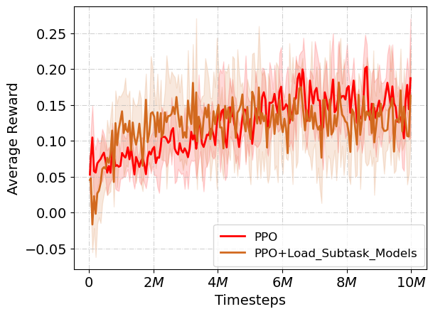
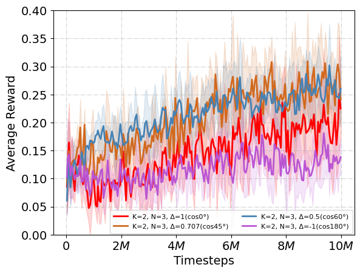
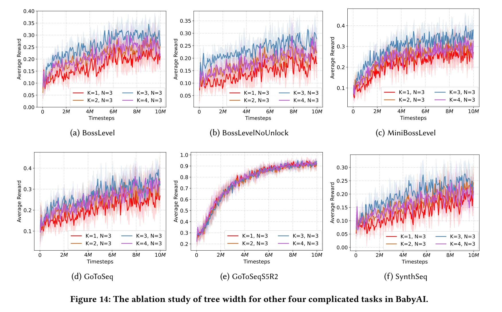
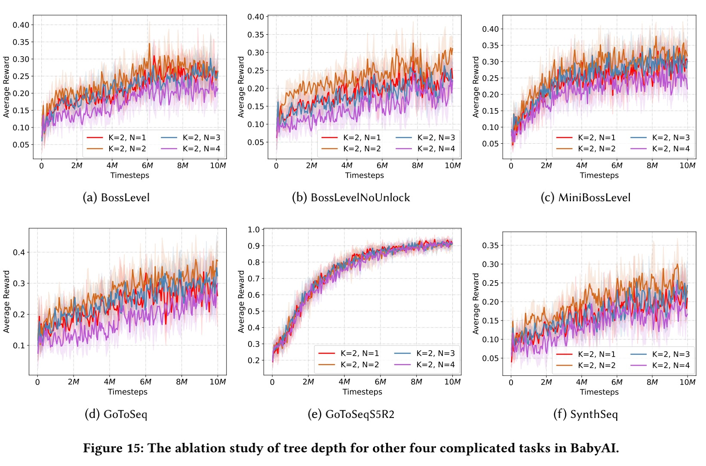

# Learning Top-K Subtask Planning Tree based on Discriminative Representation Pre-training for Decision Making

## 1. Dataset Download
We collect the dataset for training our first step, please download it from :

**link** : 
<a href="https://cowtransfer.com/s/a45e1c729caa44" style="color:rgb(0,110,255);">https://cowtransfer.com/s/a45e1c729caa44</a>

**password** : <font style="color:rgb(0,110,255);">efcf9w</font>

## 2. Installation

```python
cd babyai-KN/
conda env create -f environment.yaml

cd ../gym-minigrid/
pip install -e .

cd ../babyai-KN/
pip install -e . 

```


## 3. Discriminative Representation Pre-training

```python
cd ./scripts/3_pre_train_task/train_task_v9_recon_n_enc_1_dec
python 0.train_task_repr_2_task.py
python 1.load_model_plt_cluster_2_tasks.py
```


## 4. Task Tree Generation

### **4.1 train a subtask plnning tree with tree-width==2, tree-depth=3, and similarity-score-threshold = 0.5 :**

```python
cd ./scripts/3_pre_train_task/train_task_v9_recon_n_enc_1_dec

CUDA_VISIBLE_DEVICES=0 python 4.generate_tree_train.py --env 'BabyAI-BossLevel-v0' --K 2 --N 3 --sim_threshold 0.5
```

### **4.2 load the corresponding subtask model from the pre-trained PPO.**

Tips: we have tried another idea. However, we load the model from the pre-trained PPO (parameter frozen) of the corresponding subtask, but it can only touch the performance of the PPO. 


```python
cd ./scripts/3_pre_train_task/train_task_v9_recon_n_enc_1_dec

CUDA_VISIBLE_DEVICES=0 python 4.generate_tree_train_load_models.py --env 'BabyAI-BossLevel-v0' --K 2 --N 3 --sim_threshold 0.5
```



The result shows that:
- The model performs better in the beginning, because of the loaded subtask model from the pre-trained PPO.
- However, the model performance degrades in the later stages. Because the parameter frozen mechanism may lead the prediction error for the interacting subtask dynamics.


----------------------------------------------------------------

## 5. Additional Experimental Results

### 5.1 Additional Experimental Results on the Threshold of Similarity Score.

Following the suggestion of Reviewer 1, we have conducted a set of experiments about the threshold as follows.


 

**The explanation of the cosine similarity score:**
- Cosine similarity scores range from -1.0 to 1.0, which corresponds to 180° to 0° of the angle between two vectors. 
- The **larger** the **similarity score**, the **smaller** the **angle** between the two vectors, that is, the higher the cosine similarity, the slower the subtask changes.
- Some special angles : 
    - cos0° = 1, two vectors have the same direction.
    - cos90° = 0, two vectors are orthogonal.
    - cos180° = -1, two vectors have opposite directions.

The experimental results sho$\Delta$ that:
- The purple line: Δ = cos180° = -1, means that never change the subtask in one episode. It shows the worst performance, which indicates that there should have a correct subtask to guide policy learning.
- The red line: Δ = cos0° = 1, means that always change the subtask in one episode and shows the best performance. Regenerating the subtask every time according to the current state is an oracle choice, however, it brings a larger time cost and training burden.
- The blue line: Δ = cos60° = 0.5, and the brown line: Δ = cos45° = 0.707, has the similar performance. We choose the blue line (Δ = cos60° = 0.5) as our default configuration because it can decrease the time cost by controlling the change of subtasks not too drastically. 
- Furthermore, automatically picking a proper threshold configuration to balance the training complexity and performance will be an interesting research challenge.

------------------------------

### 5.2 Experimental Results on Tree Width

The analysis of ablation study (also called sensitivity analysis in some domains) about **tree width (parameter K)** can be found in Appendix A.6.

 


------------------------------

### 5.3 Experimental Results on Tree Depth

The analysis of ablation study (also called sensitivity analysis in some domains) about **tree depth (parameter N)** can be found in Appendix A.7.

 
 


